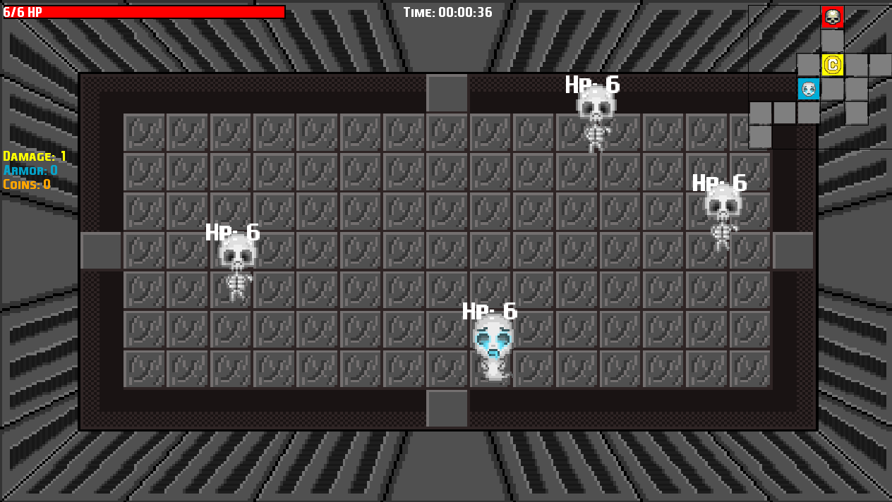
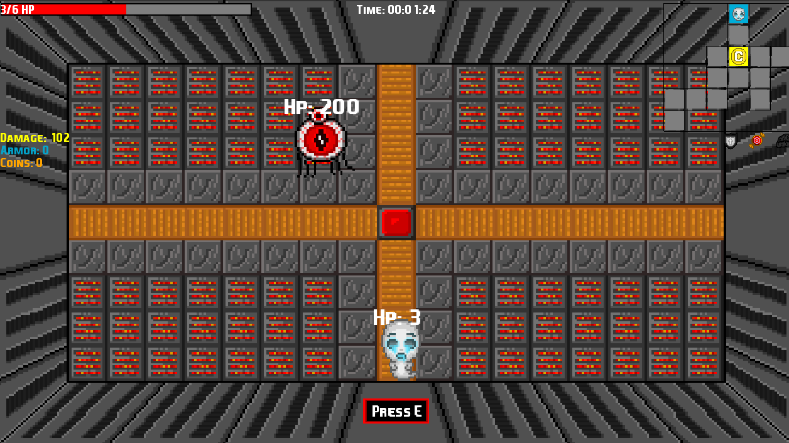
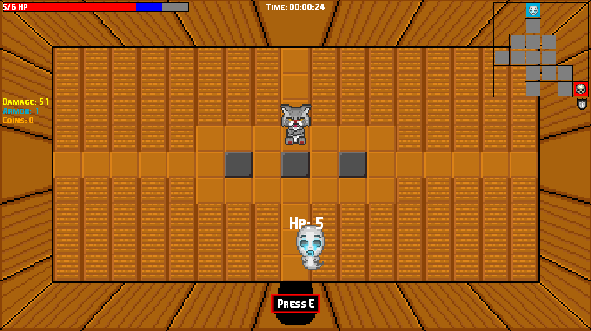
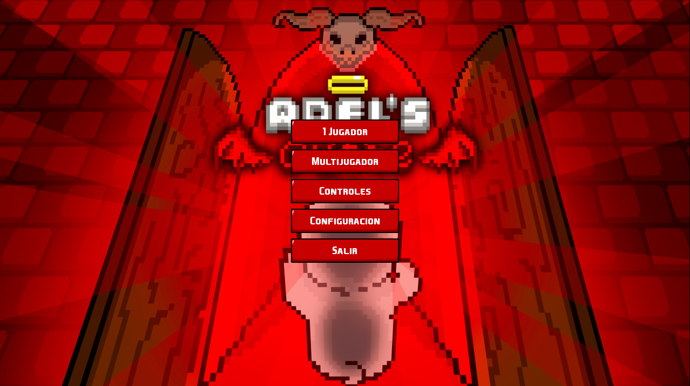
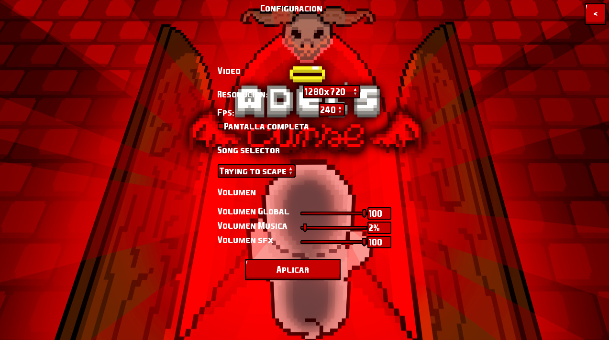

# Adel's Curse

**Adel's Curse** es un juego desarrollado con **LibGDX** para aprender a como hacer videojuegos en **RED**.

## 🎮 Características
- **Exploración** de mazmorras generadas proceduralmente.
- **Combate** contra enemigos con IA.
- **Sistema de inventario y tienda** para mejorar tu stats.
- **Jefes finales** con dificultad aumentada.

## 📥 Descarga
Puedes descargar el juego desde el siguiente enlace:  
<a href="https://drive.google.com/file/d/1GJenYi_7_9FpGcx9PJ1d2nDGXJufDL22/view?usp=sharing" download="Adels_Curse">🔗 Descargar Adel's Curse</a>

## 🚀 Requisitos
- **Java 8+**
- **Sistema Operativo:** Windows, Mac, Linux
- **Memoria RAM:** 2GB mínimo

## 🛠️ Tecnologías usadas
- **Lenguaje:** Java
- **Motor:** LibGDX
- **Interfaz:** Scene2D

## 📷 Capturas

    
    
    
    
    

